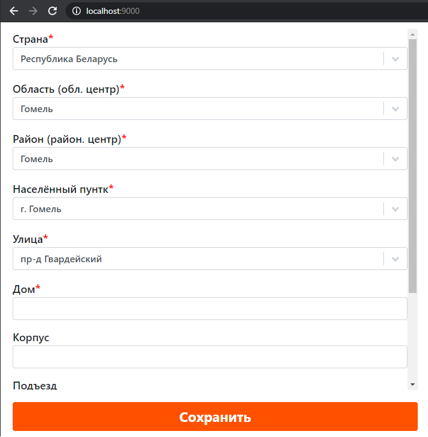
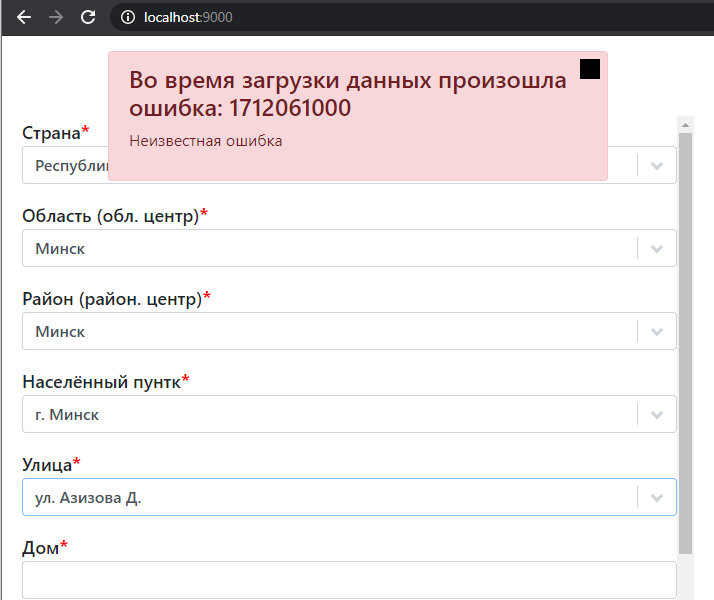

# Форма заполнения адреса.

Условия: Данные для полей: Страна, Область, Населённый пункт, Улица запрашиваются с сервера. Eсли количество значение для любого из этих полей приходит в единичном экземпляре, то его заполнение происходит автоматически.

Результаты:

1. "Рисунок 1" - работоспособность приложения;
1. "Рисунок 2" - сообщение об ошибке (на чёрный квадратик слева оно закрывается);

